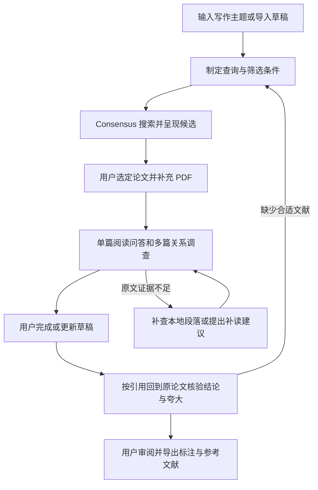

# PaperTrace 最小可用版本设计

日期：2026-10-06。状态：设计草案，用于小组讨论、Proposal 编写与后续实现；本文中的功能和指标是计划与验收标准，不代表已有实现或实验结果。PaperTrace 为暂定项目名。

## 小组同步摘要

PaperTrace 面向正在阅读和写作的研究者，按“主题或草稿输入 → Consensus 搜索 → 用户选择 → 本地阅读交互与关系调查 → 写作后的引用原文复核 → 审阅导出”完成任务。找文献、问论文、比较论文和检查引用也可独立启动。

首版的重点是三个可评估能力：智能体根据证据缺口主动补查；本地 RAG 文本检索与 Wiki 关系检索并行寻找证据；对草稿已经标注的引用返回原论文复核，识别不支持、遗漏条件及夸大。95% 是指定测试集上的检索和核验目标，尚待实验验证，不是所有回答的正确率承诺。

| 讨论项 | 当前决定 |
|---|---|
| 文献发现 | Consensus 官方 API；不依赖付费全文片段 |
| 本地阅读 | 上传 PDF，文本检索与轻量 Wiki 关系索引并行，所有结论保留原文位置 |
| 引用复核 | 按已标注引用定位原论文，对论断与证据逐条核对；建议改动由用户采纳 |
| 交付形式 | 本地工作台、证据报告、Markdown 标注稿与 BibTeX |
| 独立评审 | Jev 指类似 LLM-as-a-Judge 的独立评审；在证据检索之后检查关系与引用结论 |
| 后续扩展 | Zotero 插件、Word 插入与完整图谱，均不阻塞首版 |

小组现阶段共用这一份“项目方案与技术设计”即可：摘要承担 PRD 中的用户目标与范围说明，后文承担流程、接口、评估与实现说明。正式提交另用课程 Proposal 模板。根目录 `ARCHITECTURE.md` 继续说明现有目录与运行入口，不复制产品需求。组员讨论重点为测试领域、证据标注规则、95% 目标的可行性、模型与嵌入接口，以及独立评审的调用成本；分工由小组确认。

## 项目目标

构建一个由写作需求驱动的文献研究智能体，帮助用户从主题或已有草稿出发，通过 Consensus 搜索与筛选论文，在阅读中理解单篇内容及跨论文关系，最后为草稿提供经过证据核验的引用建议。首版提供一个本地工作台，各模块可以独立使用，也能组合完成端到端流程。

项目重点是让智能体依据检索结果和证据缺口决定下一步：修改搜索词、选择阅读段落、补查原文、核验论文关系或停止并报告不足。搜索结果摘要、用户笔记和模型推断都不能直接视为已经核验的全文证据。

## 用户流程

用户决定研究目标、最终文献选择、正文表述及是否采纳引用建议。智能体负责搜索、初筛、调查、核验和整理结果。用户选定论文后，系统进入待阅读状态；用户提交更新草稿后再启动引用检查，不把用户阅读或写作等待当作执行失败。

| 独立入口 | 最小输入 | 结果 |
|---|---|---|
| 找文献 | 主题或一段草稿 | 候选论文、相关性说明、摘要级总结和筛选理由 |
| 读论文 | 一篇 PDF 和问题 | 带原文片段与位置的回答，或证据不足说明 |
| 比较论文 | 两篇以上 PDF 和比较问题 | 关系表、方法与实验比较、对应证据 |
| 检查引用 | 带标注的草稿和引用映射或可用文献 | 原论文复核报告、引用建议、支持状态、表述修改建议及导出文件 |

## 首版范围

首版以一个研究子领域验证系统。用户输入可为中文，论文正文限定为可提取文本的英文 PDF；草稿支持粘贴文本或导入 UTF-8 的 `.md`、`.txt` 文件。系统只读取用户明确导入或选定的内容，不自动扫描写作软件或后台监控文档。

| 必做能力 | 具体范围 |
|---|---|
| 写作需求分析 | 提取问题、关键词、待核验论断与纳入排除条件 |
| Consensus 检索 | 一个官方 REST API 适配器；查询改写、结果去重、缓存和失败处理 |
| 候选呈现 | 展示身份信息、来源链接、筛选理由及摘要或片段的证据层级 |
| 本地阅读 | 用户上传 PDF，按页提取；RAG 文本与 Wiki 关系检索并行；单篇问答和多篇比较 |
| 关系调查 | 背景引用、方法使用、结果比较，以及无法确定；可附方法变化描述 |
| 引用核验 | 为可核验论断匹配文献；按已标注引用回到原论文检查准确性、适用条件与夸大 |
| Jev 独立评审 | 独立上下文复核关系与引用结论，返回结构化判定，并在必要时触发补查 |
| 结果保存 | 本地保存任务、证据和阅读笔记；导出 Markdown 标注稿及 BibTeX |

首版不包含 Zotero 原生插件、Word 动态引用插入、PDF 内高亮编辑、OCR、付费墙全文抓取、自动下载全库、多智能体协作、向量数据库或复杂图谱界面。Zotero 联动在核心流程通过验收后再实施；首版导出的 BibTeX 可作为交换入口。用户可上传来自 Zotero 的 PDF，但首版不直接读写其内部数据库。

### 初始任务预算

以下为可配置的工程上限，后续通过小规模任务调整，不是课程要求或服务保证：

- 每个检索任务最多 3 个不同查询，每个请求最多 20 条候选；去重后最多保留 30 条。
- 一个工作区最多深读 5 篇 PDF；超过时由用户缩小范围。
- 每个问答或引用检查任务最多 8 次本地证据读取；草稿每批最多核验 10 个论断。
- API 请求重试也计入网络请求预算，单任务网络尝试最多 5 次；正常请求遵守账户速率限制。
- 一个未支持论断最多进行 2 轮补查；预算用尽时保留缺口，禁止继续无限搜索。

## Consensus 接入

首版使用官方 REST API，接口为 `GET https://api.consensus.app/v1/search`，密钥通过 `x-api-key` 请求头传入。基本请求使用 `query`，设置 `page=0`、`page_size=20`；年份等过滤条件只在用户需求或筛选计划中明确需要时传入。[API 入门](https://docs.consensus.app/api-get-started)、[搜索接口](https://docs.consensus.app/api-reference/query-for-relevant-papers)

适配器将服务返回值转换为内部论文记录，保留 `title`、`authors`、`doi`、`publish_year`、`url`、`abstract`、`takeaway` 等可用字段和原始响应。缺失字段保留为空；`url` 不默认视为 PDF 下载地址，书目 `pages` 不默认视为某条证据的 PDF 页码。DOI 规范化后优先用于去重，无 DOI 时用标题、年份和作者辅助匹配；模糊匹配结果须可人工核对。

`takeaway` 是检索服务提供的总结，只用于初筛；系统自己的候选总结必须说明基于摘要、服务总结还是原文。`semantic_score`、引用数和排序名次不能直接当作论文质量或论断支持度。

基础配置不要求全文片段。可选的 `include_full_text_chunks=true` 受套餐权限约束，返回的是部分开放获取论文中的相关片段，不是完整论文，且可能为空。片段保留服务标注的章节与来源，只有与用户上传的 PDF 成功匹配后才补充本地页码。无 PDF 时，片段级回答标为“基于 API 片段”，不宣称全文核验。[全文片段说明](https://docs.consensus.app/api-full-text)

API 和 MCP 共享账户额度，套餐也限制分页、返回数量与片段能力。首版按实际账户能力配置，不自动升级套餐或开启超额计费。额度检查、缓存与任务预算用于控制调用量。[套餐与访问说明](https://docs.consensus.app/api-plans-and-access)

| 情况 | 处理 |
|---|---|
| 无密钥或 401 | 提示配置问题，保留当前任务；不重复提交 |
| 403 功能无权限 | 关闭可选片段或分页能力，退回基础搜索 |
| 429 短期限流 | 按 `retry-after` 等待并在预算内重试 |
| 429 月度额度耗尽 | 停止在线检索；可继续使用已有结果和本地文献 |
| 402 或账户计费问题 | 停止请求并提示账户问题 |
| 超时或 5xx | 有界重试；仍失败时保存错误与已完成结果 |
| 结果不足 | 改写查询或放宽经用户允许的条件；记录变化 |

首版不实现 MCP Server。若后续需要从外部 Agent 使用该工作台，再提供 MCP 包装，不维护两套检索逻辑。

## 智能体决策与模块

### 单智能体执行器

使用一个支持工具调用的语言模型及轻量执行循环。执行器校验工具参数、记录动作与结果、限制调用预算，并维护“已查内容、待验证判断、证据缺口、用户选择”。模型名称和服务地址可配置，不要求训练或微调模型。

模块入口采用相同任务状态和证据结构。流程状态为：需求分析、检索中、待用户选择、阅读调查、待用户更新草稿、引用核验、完成或部分完成。状态是显式数据，不依赖模型在长聊天中记住全部内容。

| 决策点 | 智能体行为 | 必须留下的信息 |
|---|---|---|
| 查询过窄或结果无关 | 修改术语或查询角度 | 旧查询、新查询和修改理由 |
| 摘要不足以解释方法 | 阅读方法章节或引用上下文 | 所选段落与问题的关系 |
| 两篇结果不可直接比较 | 检查数据集、指标和实验设置 | 可比性及限制条件 |
| 关系或引用支持不足 | 补查原文、收缩判断或保持未确认 | 使用证据及剩余缺口 |
| 达到上限或无法访问正文 | 停止并输出部分结果 | 停止原因与建议补充内容 |

判断输出只记录简短的动作理由和核验依据，不要求模型输出内部思维过程。论文、草稿和 API 返回文本作为待分析数据，不能修改系统工具权限或预算。

### 最小工具契约

| 工具 | 输入 | 输出 |
|---|---|---|
| `search_papers` | 查询、允许的过滤条件 | 候选、来源、响应缓存标识及错误 |
| `list_local_papers` | 工作区标识 | 已选论文及正文可用状态 |
| `search_passages` | 论文范围、查询、返回上限 | 并行文本与 Wiki 检索后融合的原文片段、两路来源及排名 |
| `read_passage` | 片段标识、上下文范围 | 原文、邻近内容和来源位置 |
| `read_reference_context` | 论文标识、引用线索 | 原文中的引用上下文和可能的文献匹配；允许返回无法匹配 |
| `save_result` | 结构化结果 | 本地保存位置，不覆盖原始 PDF 或输入草稿 |

引用建议和关系结论由执行器基于这些工具输出生成。导出是确定性格式处理，不让模型凭记忆生成作者、DOI 或参考文献。

### 模块行为

检索模块从主题或草稿提取检索角度，包括支持证据、限制条件与不同结果，按明确条件筛选，不只寻找赞同草稿的论文。候选清单显示相关性理由与证据层级，用户确认后才加入深读集合。

阅读模块按页提取 PDF 文本，切片保留页码并检索邻近上下文；文本与 Wiki 两路检索共享原文片段标识，具体见下节。PDF 页码使用从 1 开始的文件页序号，论文印刷页码另存；双栏提取混乱、表格或公式无法可靠读取时标记相关内容不可用，不继续生成精确数值或公式结论。

关系模块先提取明确引用，再判断背景、方法使用、结果比较等类型。“主题相似”可列为内容关联，但不能当作引用边；方法变化需要两篇原文依据，性能优劣需要记录实验条件。首版调查范围为已选论文间关系，对库外引用显示“建议补读”，不自动递归扩展文献库。

引用模块将草稿拆为可核验论断；非经验性背景、作者计划或个人表述不机械地要求引用。已有引用按原论文优先核验，缺失引用另行匹配，不能用新找到的论文掩盖原引用错误。每条结果显示原引用或建议文献、原文证据、支持状态、限制条件和建议位置。部分支持时指出应该缩小哪一部分；冲突或不足时保留提示，不强行插入引用。

输出采用 Markdown 中的 `[P1]` 等工作区稳定标识，参考文献区映射到核对后的论文记录，同时导出 BibTeX。该标识是可审阅的标注草稿，不是 Word 或 Zotero 的动态引用字段。正文修改和引用采纳由用户决定。

### 本地 RAG 与 Wiki 并行检索

RAG 是检索证据后再生成回答的流程；Wiki 在本项目中是由论文、概念、方法和引用关系构成的可链接知识索引，不是安装 Wikipedia 或 MediaWiki。两者在同一 RAG 流程中提供不同的证据入口。双路检索能否提高召回由消融实验验证，不预设效果。

| 路线 | 索引与检索 | 最终返回 |
|---|---|---|
| 文本路线 | 对原文片段做 BM25 关键词检索及文本嵌入相似度检索，合并各自前 10 条 | 命中的原文片段标识 |
| Wiki 路线 | 从问题匹配论文、方法、概念和中英文别名节点，最多扩展一跳链接，再获取节点关联的片段，最多 10 条 | 原文片段标识及经过的节点链接 |

论文导入时创建论文卡片，提取必要的方法与概念节点、别名和关系；自动生成的关系标为待核验。每个节点与链接保存来源片段 ID 和 PDF 版本。用户笔记可以作为检索线索，但不能作为论文结论依据；没有原文锚点的 Wiki 摘要不能用于支持论断。首版只为当前已选文献建立索引，不构建全领域知识图谱。

每次查询并行运行两路，按论文与片段 ID 去重；使用倒数排名融合（RRF）合并文本内排名及 Wiki 排名，再按问题相关性选取最多 10 个片段。排序保留两路来源，并兼顾不同论文；相关性重排不能把不支持原文的片段变成证据。生成前读取必要的上下文与限制章节。已有引用的核验将检索范围约束为该引用对应的论文，避免混入其他论文造成错误通过。

首版用本地文件持久化嵌入与关系邻接表，内存计算相似度，无需向量数据库、图数据库或完整 GraphRAG 框架。嵌入模型在实施前验证并固定，不自动下载大模型或调用付费服务。任一路失败时可降级使用另一条并标明模式；这种任务仍计入完整系统的失败或降级记录。论文更新后重新构建其片段、嵌入和 Wiki 来源映射。

概念和关系关联原文的设计可参考 [GraphRAG Local Search](https://microsoft.github.io/graphrag/query/local_search/)，这里只借鉴检索组织方式，不承诺复用或达到该框架的效果。

### 写作后的引用原文复核

此入口接受带 `[P1]` 等标注的草稿及映射。其他格式的引用必须先由用户提供“标记 → DOI 或论文 ID”的映射；无法唯一匹配作者年份或编号时报告歧义，不能猜测对应论文。首版不解析 Word 的动态字段或完整 LaTeX 项目。

1. 将带引用的句子拆为独立论断，保留原文范围、草稿版本及引用标记。一个句子包含多个结论时分别检查。
2. 解析引用并定位确切论文，检查版本及正文可用性。缺少引用论文时显示“无法核验”，不记为支持或内容冲突。
3. 在被引论文内并行检索相关结论、方法或实验段落，必要时补查限制条件和邻近上下文；引用论文对其他工作的描述不能自动当作该论文自己的实验结果。
4. 对照检查对象与场景、方法和数据集、指标与数值、比较基线、不确定性、因果与相关措辞、作者声明的限制。若具体数据在无法解析的图表中，转人工检查。
5. 对多篇引用既逐篇报告贡献，也检查合并证据是否覆盖全部论断；一篇不支持时不能由其他论文自动使其通过。
6. 输出支持、部分支持、冲突、证据不足或无法核验。附原文片段、页码、问题位置、建议更正和待补证据；用户审阅后才形成导出修订稿。

重点检测“在特定数据集改善”写成“普遍有效”、“相关”写成“导致”、“作者提出可能性”写成“已经证明”、漏掉失败场景、数值或比较对象错误等情况。查到真实引用与定位到真实片段只证明来源存在，不能证明正文忠实于该来源。此功能用于减少不准确和夸大，不保证消除全部错误。

### Jev 独立证据评审

Jev 在本设计中指类似 LLM-as-a-Judge 的独立评审机制，不是额外指定的软件包。它放在原文检索之后、结果导出之前：独立评审调用只接收待检查论断或关系、引用映射、原文上下文及统一规则，输出支持状态、问题类型、证据 ID 与修改建议，不接收生成器先前的支持度判断、自评或解释，以减少先入为主。

首版在同一模型接口上使用独立上下文进行第二次评审，无需引入协作型多智能体框架；这不意味着统计上独立或免于共同错误。评审发现缺口时主执行器在预算内补查，仍不确定则转用户。评审调用计入模型用量，每个待核验论断最多一次初评及一次补查后复评。评审输出证据 ID 必须存在于实际读取的片段中，结构不合规或引用不存在时不得将其标为通过。另一个模型的评审仅作为后续可选消融，不增加首版模型依赖。

人工标注仍是测试标准，模型评审不能作为自己的准确率证明。LLM 评审存在偏差与推理局限，需报告与人工一致性及误判案例。[LLM-as-a-Judge 研究](https://arxiv.org/abs/2306.05685)

## 数据与本地架构

### 技术选择

首版建议 Python 单进程服务配合 Streamlit 本地界面，使用 PDF 文本提取、轻量 BM25、一个嵌入接口、标准库 JSON 与文件存储、一个语言模型接口和 Consensus HTTP 适配器。模型执行循环自行实现必要的工具调度，暂不引入 Agent 框架、数据库服务或复杂前后端分层。具体依赖在实施时按所选接口确定。

界面包含主题或草稿输入、候选列表与选择、PDF 导入与问答、比较结果、引用检查与导出。独立模块复用同一工作区；可打开原始 PDF 或下载证据清单，首版不承诺 PDF 内定位高亮。

### 最小数据对象

| 对象 | 必须保留的信息 |
|---|---|
| `ProjectContext` | 主题、用户选择的草稿、筛选条件、版本 |
| `PaperRecord` | 内部稳定 ID、题名、作者、年份、DOI、来源链接、选择状态及正文状态 |
| `Passage` | 论文 ID、片段 ID、原文、PDF 页序号、可用章节、文档版本 |
| `WikiNode` 与 `WikiLink` | 论文或概念标识、别名、关系类型、原文片段 ID、来源版本及核验状态 |
| `RetrievalTrace` | 查询、检索范围、两路片段排名、融合排名、重排结果及降级情况 |
| `ClaimEvidence` | 草稿版本、论断范围、论文与片段 ID、支持状态、判断性质及限制条件 |
| `PaperRelation` | 来源与目标论文、关系类型、证据片段、是否明确引用、核验状态 |
| `TaskRun` | 模块、状态、工具记录、已用预算、耗时、模型用量、错误与用户选择 |

`ClaimEvidence` 另保留生成结果、独立评审结果和最后人工采纳状态；同一草稿与证据版本下才能复用评审。

书目真实性与内容支持度分别记录。用户笔记、模型总结与论文原文分别标识；只有原文或注明来源的 API 原始片段可以作为内容依据，模型总结本身不是原始证据。

运行时工作区按需创建 `papers/`、`cache/`、`runs/`、`exports/`，不在设计阶段创建空目录。保留原 PDF、输入草稿及来源响应；导出稿另存。草稿或 PDF 内容变化时，相关论断定位与核验结果置为需重新核验，禁止直接沿用旧的“已支持”状态。

密钥保存在环境变量中，不进入日志、文档或工作区导出。Consensus 接收生成的查询；首版不上传整份草稿或 PDF 给 Consensus。若语言模型位于远端，其分析所需的草稿和论文片段会发送到该模型服务；本地存储不等于全程本地推理，界面应明确实际模式。

## 课程要求与评估

### 与 guideline 的对应

| 课程要求 | 本设计的体现 |
|---|---|
| 明确用户问题 | 写作时找论文、理解关系、确认引用支持 |
| Agent 主动决定下一步 | 查询改写、原文选择、证据补查、判断修正和停止 |
| 工具或外部资源 | Consensus、PDF 文件、片段检索和结果导出 |
| 端到端应用 | 从主题或草稿到文献选择、阅读调查和引用标注输出 |
| 实际评估 | 双路检索召回、引用复核准确性、关系判断、引用支持、任务完成与成本 |
| 可运行代码与局限讨论 | 完成单机工作台与可复现任务，报告访问缺口及解析失败 |

来源：[项目 guideline](COMP7608B_LLM_Project_Guideline.pdf)，第 1–2 页。Proposal 按第 3–4 页的组员、目标、动机与挑战、潜在方案、数据与评估组织；使用 NeurIPS 2026 模板，正文不超过 4 页，不含摘要。设计文档不替代 Proposal。

### 最小实验

先用 3 个任务检查流程，再建立约 12 个任务的初始端到端评估集：4 个主题或草稿检索任务、4 个多论文调查任务、4 个草稿引用任务，其中至少 2 个组成完整流程。选用约 15–20 篇开放获取论文作为可深读材料，每个工作区仍遵守 5 篇上限。12 个任务用于试运行，不能单独证明 95% 质量目标。

两名组员独立标注测试任务的候选相关性、关键关系、论断证据和回答要点，讨论分歧并保留无法确定项。开发和测试任务分开。每个检索查询保存时间、参数和响应快照；在线检索评估发现能力，固定候选与固定 PDF 的实验评估下游调查与核验，不将动态搜索差异混入核验效果。

| 指标 | 计算或检查方式 |
|---|---|
| 筛选相关性 | 人工标注的前 k 条结果 Precision@k；无需声称全领域召回 |
| 本地证据召回 | 锁定文献与证据标注后，比较文本、Wiki、融合检索在相同 k 下的证据覆盖 |
| 关系正确性 | 关系类型和方向准确性；证据不足项单独记录 |
| 引用支持率 | 已插入或建议采纳的引用中，人工确认充分支持的比例 |
| 关键论断覆盖 | 标注为需要引用且在给定语料中有证据的论断，被正确处理的比例 |
| 不足处理质量 | 无证据、不可比、解析失败时是否避免强行结论 |
| 端到端完成 | 用户是否得到候选、调查结果、引用清单及可用导出 |
| 资源消耗 | 网络与模型调用数、token、耗时；预处理另计 |

将固定检索后单次生成作为基线，与完整智能体使用相同模型、候选、PDF 及工具预算上限比较。再移除补查核验循环，观察证据支持和关键论断覆盖变化。系统输出少量易证明句子不能算高质量，因此支持率与覆盖率同时报告。核心假设是补查与核验可以提高可靠性，效果需实验验证。

### 95% 目标的定义与测试

召回、检索精确率和核验准确性是不同指标，不能合并称为“准确率”。以下均为项目验收目标，不是保证或已取得结果。

| 指标 | 明确定义 | 目标 |
|---|---|---|
| `EvidenceRecall@10` | 每题人工标注必要证据要点；每个要点有一组等价可接受片段。前 10 个检索片段覆盖的要点数除以该题必要要点数，再对有可用证据的题目取平均 | ≥95% |
| 检索片段精确率 | 最多前 10 个片段中人工判定相关的数量除以实际返回数量，同时报告返回数量；零返回时精确率未定义，有答案题的召回记为 0 | 报告实际结果，与召回同时比较；不等同于论断支持 |
| 引用支持判定平衡准确率 | 对可核验案例，将人工标注“充分支持”作为正类，部分支持、冲突和不足作为负类；充分支持召回率与非充分支持召回率的平均值 | ≥95% |
| 引用支持精确率 | 系统判为充分支持的案例中，人工确认充分支持的比例；没有通过案例时指标未定义 | ≥95%，同时报告通过数量与论断覆盖 |

`EvidenceRecall@10` 是证据要点召回，不是整篇论文召回，也不等同于常规片段集合 Recall@10。采用要点与等价片段组是为了避免同一证据重复切片被多次计分，并检查比较任务是否找到所有必要信息。评估截断后的最终前 10 条，而非未经预算限制的候选全集。

初始验收集计划包含至少 60 个本地检索问题，其中单篇事实、方法或引用上下文、多篇比较各 20 个；引用复核另标注至少 100 个案例，尽量平衡充分支持与非充分支持，并覆盖漏掉条件、因果夸大、数值错误和比较对象错配。来自同一草稿或同一论文组合的案例不得跨开发与测试集；锁定测试集后不继续调整参数。以上样本规模用于可操作的初步评估，不构成统计精度保证。

无答案、缺正文、解析失败案例另外测拒答和无法核验识别率，并在总任务完成率中报告；不能通过删掉困难案例让目标达标。对可核验案例，系统选择弃权仍留在平衡准确率分母并按错误判定计入，同时单列弃权率。所有质量指标附分子、分母与适合的 95% 置信区间；点估计达标不代表置信下限达标，更不能推断任意领域均达标。自动 Judge 不生成测试真值。

消融使用同一文献、分块、问题、最终 k 和上下文预算，比较文本路线、Wiki 路线与双路融合；记录召回、精确率、延迟、嵌入与 Wiki 构建成本。单次检索与两轮补查后的覆盖分别报告，不混用口径。比较独立评审启用与关闭时的引用误判和成本，使用同一人工标注标准。

未达到目标时报告具体数值和失败类型，优先修正文档解析、概念别名、分块及检索排名，或明确缩小适用范围；不得将开发集调优结果当作测试达标。

API 缓存回放仅用于复现实验和额度不足时继续本地工作，不能当作实时 Consensus 搜索成功。最终验收至少包含一次真实在线搜索及一次完整流程；所有预算耗尽、接口失败和未完成任务计入记录。

## 实现顺序与验收

| 顺序 | 实现内容 | 验收条件 |
|---|---|---|
| 1 | Consensus 搜索与候选选择 | 真实请求可返回结果；去重、来源和缺失字段可检查；错误不被伪装为成功 |
| 2 | PDF 提取与双路证据问答 | 上传两篇论文；两路检索与融合可检查；回答能回查到原文和页码；完成文本与 Wiki 的消融 |
| 3 | 关系调查与执行循环 | 根据证据缺口调用下一工具；给出至少一种有原文支持的关系，并保留无法确定项 |
| 4 | 草稿引用原文复核与导出 | 已有引用必须核对对应论文；能标出限制条件或夸大；引用无法解析不猜测；标识与 BibTeX 一一对应 |
| 5 | 独立入口与完整流程 | 既能单独检查引用，也能从主题走完搜索、选择、调查与导出；中间状态可恢复 |
| 6 | 初始评估与 Proposal 校准 | 报告证据召回与核验准确性是否达到 95% 目标、样本量和成本；未达到须明确说明 |

完成标志是一条可运行的完整流程和相关实际评估。只有界面、搜索结果展示或单轮论文聊天，不构成完整项目。

## 依赖条件与后续扩展

实施前验证 Consensus 账户密钥、额度、所选领域检索覆盖和模型工具调用能力。免费账户额度可能只适合少量在线试验，测试规模需与实际额度匹配。论文全文由用户提供或通过可访问的来源获得，不假设搜索接口能返回整篇文献。

核心验收后再考虑 Zotero 插件：选取已有条目和附件、启动本地分析、查看证据、将审阅后的结果保存为笔记。持续研究记忆、库外引用扩展、可视图谱和更丰富文件格式也放在后续阶段；本地轻量 Wiki 索引属于首版，不依赖可视图谱。

Agentero 提供文献上下文组织、外部 Agent 接入和工具接口的参考；本项目聚焦写作驱动的搜索、调查和引用核验闭环。若后续复用其代码，记录版本、许可和小组实际新增工作，不将上游能力列为原创贡献。[Agentero 仓库](https://github.com/poco-ai/Agentero)

Proposal 截止在 guideline 中存在冲突：第 2 页为 10 月 9 日 24:00，第 3 页为 2026 年 10 月 9 日 12:00（香港时间）。按较早时间安排并向教师或 TA 核实；Report & Code 和 Presentation 的细则仍待课程通知。
